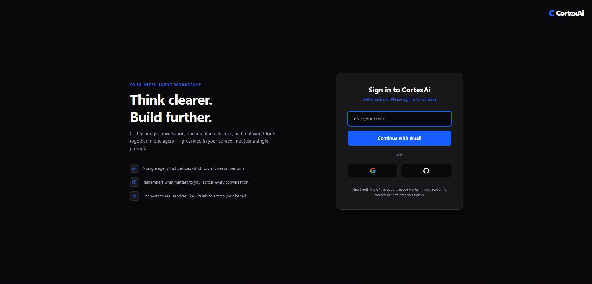
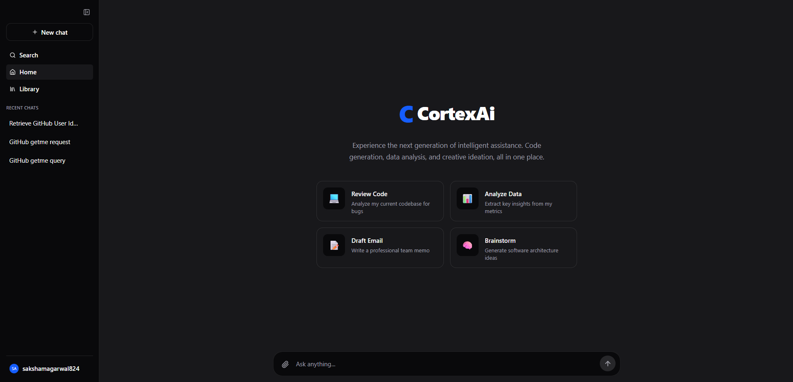
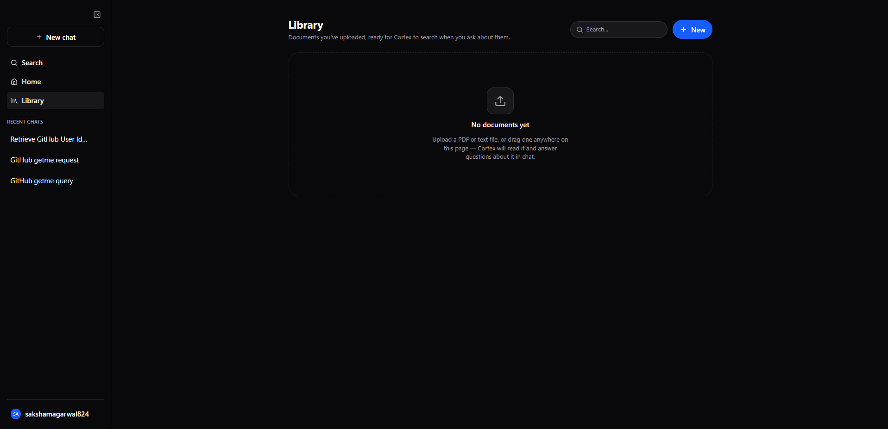
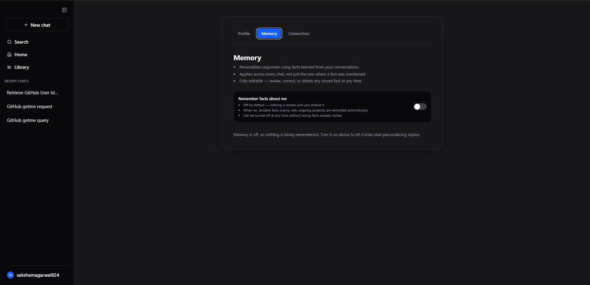
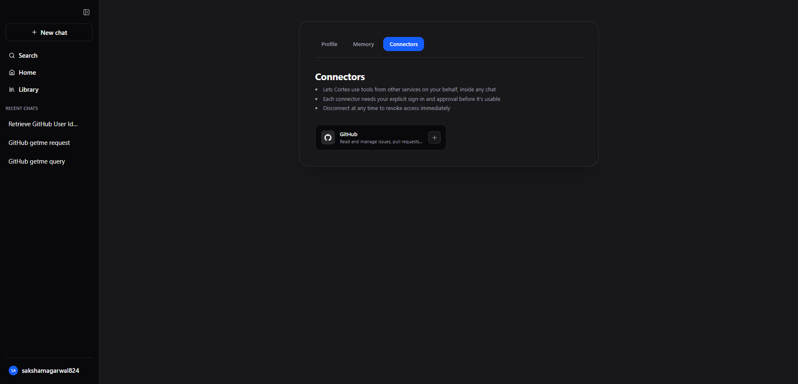

<div align="center">

# Cortex

**A multi-agent AI workspace for conversation, retrieval-augmented document Q&A, code generation, and live web search.**

[](http://cortex-developersaksham.vercel.app/)
[](#license)
[](#prerequisites)
[](#tech-stack)
[](#tech-stack)

[Live Demo](http://cortex-developersaksham.vercel.app/) · [Repository](https://github.com/Saksham-A-garwal/Cortex) · [Report Bug](https://github.com/Saksham-A-garwal/Cortex/issues) · [Request Feature](https://github.com/Saksham-A-garwal/Cortex/issues)

</div>

---

## Table of Contents

1. [Overview](#overview)
2. [Key Features](#key-features)
3. [Screenshots](#screenshots)
4. [Architecture](#architecture)
5. [Tech Stack](#tech-stack)
6. [Getting Started](#getting-started)
   - [Prerequisites](#prerequisites)
   - [Installation](#installation)
   - [Configuration](#configuration)
   - [Running Locally](#running-locally)
7. [Deployment](#deployment)
8. [Project Structure](#project-structure)
9. [Backend Details](#backend-details)
10. [Frontend Details](#frontend-details)
11. [Environment Variables](#environment-variables)
12. [Known Limitations / Roadmap](#known-limitations--roadmap)
13. [Contributing](#contributing)
14. [License](#license)

---

## Overview

Cortex is a full-stack AI workspace built around a single **LangGraph tool-calling orchestrator** rather than a fixed router-to-specialist pipeline. One agent holds the conversation and decides, per turn, which of its tools to reach for — live web search, page reading, document retrieval, or code generation — so a simple question and a multi-step research task both get handled by the same agent without a rigid up-front classification step.

With Cortex, users can:

- **Converse naturally**, with the agent calling tools only when a question actually needs them.
- **Upload PDF or plain-text documents**, have them chunked and embedded, and ask context-aware questions grounded in that content (RAG) — plus browse, search, and preview everything they've uploaded from a dedicated Library.
- **Get code written by a specialized coding model**, routed there automatically rather than handled by the general conversational model.
- **Run live web searches and read specific pages** for up-to-date, real-world information via Tavily.
- **Sign in without a password** — email one-time codes or Google/GitHub OAuth, both backed by short-lived access tokens and rotating, revocable refresh tokens.
- **Have long conversations without hitting context limits** — older messages are automatically summarized and folded into a running summary rather than sent in full on every turn.
- **Get personalized replies across every chat**, not just the one they were mentioned in — durable facts about the user are auto-extracted, deduplicated, and injected into future conversations (opt-in, with a settings UI to view, edit, or delete what's remembered).
- **Let the agent act on a real external service** — connect GitHub via OAuth and the orchestrator can read and write real repository data on the user's behalf, through the Model Context Protocol (MCP).

**[→ Try the live demo](http://cortex-developersaksham.vercel.app/)**

---

## Key Features

| Feature | Description |
|---|---|
| **Tool-calling agent architecture** | A single LangGraph orchestrator decides per-turn which tools to invoke, bounded by a configurable per-turn tool-call budget so one open-ended question can't loop indefinitely |
| **Five built-in agent tools + connectors** | `web_search`, `read_url` (via Tavily Extract, not a raw server-side fetch — closes an SSRF path), `search_my_documents` / `list_my_documents` (RAG), `write_code` (hands coding work to a dedicated model rather than the general one), plus any tools exposed by the user's connected MCP connectors |
| **Passwordless authentication** | Email one-time codes (6-digit, rate-limited, Redis-backed) or Google/GitHub OAuth — no password field anywhere in the product |
| **Short-lived access + rotating refresh tokens** | Access tokens are unrevocable by design and expire quickly; refresh tokens are long-lived but tracked and revocable, with reuse detection |
| **Real-time streaming** | Responses stream token-by-token over Server-Sent Events; a failed generation still saves a real, specific reply (including a distinct message when the LLM provider is out of credits) instead of leaving the conversation stuck |
| **Retrieval-Augmented Generation (RAG)** | PDF/TXT ingestion → chunking → embeddings → Qdrant vector store, fully scoped per user |
| **Query reformulation** | Before retrieval, an LLM rewrites vague prompts (e.g. *"summarize this"*) into a precise vector-search query using the user's recent uploads as context |
| **Short-term memory** | Once a chat crosses a message-count threshold, older messages are summarized and folded into a running summary rather than kept verbatim — bounds per-turn token cost on long conversations |
| **Long-term memory** | Facts about the user (name, role, ongoing projects) are auto-extracted in batches, deduplicated via vector similarity, and injected into every future chat — global per user, not per-conversation. Opt-in, with a Settings UI to view/add/edit/delete facts |
| **MCP connectors** | A generic OAuth 2.0 framework lets the agent use tools from real external services on the user's behalf — GitHub is the first connector, proven end-to-end (real repo reads/writes through the discovered MCP tools) |

---

## Screenshots

### Authentication



Email OTP and Google/GitHub OAuth 2.0 are both supported on a single, unified auth screen — there is no password anywhere in the product.

### Workspace Home



The landing view inside the workspace, with quick-start prompts and the persistent chat sidebar.

### Library



Every uploaded document in one place — searchable and previewable once populated; drag-and-drop or click to upload directly from this page.

### Settings — Memory



Long-term memory is opt-in and off by default. Once enabled, durable facts are extracted automatically from conversation and applied across every chat — fully editable from this page.

### Settings — Connectors



GitHub is the first MCP connector — one click starts the OAuth flow, and once connected, the orchestrator can use GitHub's tools directly inside any chat.

### Chat History Search


The sidebar's search modal filters conversations already loaded in client state for quick navigation back to a previous chat.

---

## Architecture

### Agent Orchestration

```
                          ┌────────────────────┐
    User message ───────► │  Orchestrator Node  │◄─────────────┐
                          └──────────┬──────────┘               │
                                     │ decides: answer, or       │ tool results
                                     │ call one or more tools    │ appended to
                                     ▼                           │ conversation
                          ┌────────────────────┐                 │
                          │     Tools Node      │─────────────────┘
                          └──────────┬──────────┘
                                     │
     ┌──────────┬──────────┬────────┼─────────┬──────────┬────────────────┐
     ▼          ▼          ▼        ▼         ▼          ▼
┌──────────┐┌─────────┐┌─────────┐┌─────────┐┌─────────┐┌────────────────────┐
│web_search││read_url ││search_my││list_my  ││write_code││ connector tools     │
│(Tavily)  ││(Tavily  ││documents││documents││(deepseek ││ (MCP, discovered    │
│          ││Extract) ││ (RAG)   ││ (RAG)   ││ -r1)     ││ per-user at runtime)│
└──────────┘└─────────┘└─────────┘└─────────┘└─────────┘└────────────────────┘

   Bounded by a per-turn tool-call budget (MAX_TOOL_CALLS_PER_TURN) — the loop above
   terminates with a plain-prose answer once the budget is spent or the model stops
   requesting tools. Connector tools aren't fixed at compile time — they're merged into
   this same list per-request, based on which services the current user has connected.
```

### System Overview

```
┌───────────────────────┐   SSE (text/event-stream)   ┌───────────────────────────┐
│    Frontend (React)    │◄────────────────────────────►│  Backend (Node/Express)   │
│  • Chat UI              │                              │  /auth /chats /messages   │
│  • Library (docs)       │                              │  /documents /users        │
│  • Settings (profile,   │                              │  /memory /connectors      │
│    memory, connectors)  │                              └────────────┬──────────────┘
└───────────┬─────────────┘                                           │
            │                                                          ▼
            ▼                                              ┌───────────────────────┐
   ┌────────────────────┐                                  │   LangGraph Graph      │
   │ OTP (email) or       │                                │  Orchestrator ⇄ Tools  │
   │ Passport (OAuth)     │                                └───────────┬────────────┘
   └────────┬─────────────┘                                            │
            ▼                                       ┌────────────────┬─┴───────────────┐
   ┌─────────────────────────┐                       ▼                ▼                 ▼
   │ Access token (JWT) +     │            ┌──────────────────┐ ┌──────────────┐ ┌──────────────┐
   │ rotating refresh token   │            │ Qdrant: RAG +      │ │ MCP connector │ │ Tavily search │
   │ (Mongo) · rate limits &  │            │ LTM collections    │ │ (GitHub OAuth)│ │ + page extract│
   │ OTP state (Redis)        │            └──────────────────┘ └──────────────┘ └──────────────┘
   └─────────────────────────┘
```

---

## Tech Stack

| Layer | Technology |
|---|---|
| **Frontend** | React 19 + Vite · Redux Toolkit · Tailwind CSS 4 · `react-markdown` (+ `remark-gfm`, `rehype-katex`) · `react-syntax-highlighter` · `@microsoft/fetch-event-source` |
| **Backend** | Node.js · Express 5 · `dotenv` · `express-session` · `passport` · `cors` · `multer` |
| **Database** | MongoDB + Mongoose (users, chats, messages, document metadata, refresh tokens, OTP requests) + GridFS (original uploaded file bytes, for Library preview) |
| **Vector Store** | Qdrant — a document-RAG collection and a separate long-term-memory collection, both with an in-memory fallback for local development |
| **Cache / Rate Limiting** | Upstash Redis — OTP request rate limiting and refresh-token reuse detection |
| **LLM Providers** | OpenRouter (default) · Anthropic · Google Gemini · Groq — switchable per-deployment via `AI_PROVIDER`; Gemini embeddings for RAG and memory |
| **Orchestration** | LangGraph (`@langchain/langgraph`), single tool-calling orchestrator agent |
| **Tools** | Tavily (web search + page extraction); MCP connector tools discovered at runtime via `@langchain/mcp-adapters` |
| **MCP** | Generic OAuth 2.0 Authorization Code framework, catalog-driven (one connector = one data row) — GitHub is the first connector, proven end-to-end |
| **Authentication** | Passwordless — email OTP (via Resend's HTTP API) or Google/GitHub OAuth 2.0 (`passport-google-oauth20`, `passport-github2`) — backed by short-lived JWT access tokens and rotating, revocable refresh tokens |
| **Testing** | Node's built-in test runner (`node:test`) + `supertest` for integration tests against the real Express app |
| **Deployment** | Render (backend) · Vercel (frontend) |
| **Package Manager** | npm — `.npmrc` sets `legacy-peer-deps=true` |

---

## Getting Started

### Prerequisites

- **Node.js** 18 or later
- **npm**
- A **MongoDB** instance (local or Atlas)
- API keys for the providers you intend to use — see [Environment Variables](#environment-variables)
- A **Qdrant** instance *(optional — omit to use the in-memory fallback locally)*

### Installation

```bash
git clone https://github.com/Saksham-A-garwal/Cortex.git
cd Cortex

cd Backend && npm install    # .npmrc already sets legacy-peer-deps, no extra flag needed
cd ../Frontend && npm install
```

### Configuration

Create a `.env` file inside `Backend/` — see [Environment Variables](#environment-variables) for the full list. If a `.env.example` is present, copy it as a starting point:

```bash
cd Backend
cp .env.example .env
# fill in the values described below
```

The frontend reads its backend URL from Vite's environment variables, e.g. in `Frontend/.env`:

```env
VITE_API_URL=http://localhost:5000
```

### Running Locally

```bash
# Terminal 1 — Backend
cd Backend
npm run dev     # nodemon, defaults to http://localhost:5000

# Terminal 2 — Frontend
cd Frontend
npm run dev     # Vite dev server, defaults to http://localhost:5173
```

Open **http://localhost:5173** to reach the login page. After signing in (email OTP or OAuth), you'll land in the chat workspace.

---

## Deployment

### Backend — Render

| Step | Value |
|---|---|
| Service type | Web Service |
| Root directory | `Backend` |
| Build command | `npm install` |
| Start command | `node server.js` |
| Environment variables | See [table below](#environment-variables) |

Render picks up `.npmrc` automatically, so LangChain peer-dependency install issues are handled without extra flags.

### Frontend — Vercel

1. Import the repository into Vercel and set **Root Directory** to `Frontend`.
2. Add the environment variable `VITE_API_URL`, pointing to your deployed backend (e.g. `https://cortex-backend.onrender.com`).
3. Deploy. For explicit client-side routing rewrites with React Router, add a `vercel.json`:

```json
{
  "rewrites": [{ "source": "/(.*)", "destination": "/index.html" }]
}
```

**Live production deployment:** [cortex-developersaksham.vercel.app](http://cortex-developersaksham.vercel.app/)

---

## Project Structure

Both apps are organized **by feature module**, not by technical layer — everything for "auth," "memory," "connectors," etc. lives in one folder, so understanding one feature means opening one directory rather than five.

```
Cortex/
├─ Backend/
│  ├─ src/
│  │  ├─ modules/
│  │  │  ├─ auth/               # Site login: OTP + Google/GitHub sign-in, tokens
│  │  │  │  ├─ auth.controller.js / auth.routes.js / auth.service.js / auth.schema.js
│  │  │  │  ├─ token.service.js       # Access/refresh token issuance and rotation
│  │  │  │  ├─ otp.service.js         # OTP generation, hashing, verification
│  │  │  │  ├─ otpRequest.model.js / refreshToken.model.js
│  │  │  │  ├─ otpRateLimit.middleware.js
│  │  │  │  └─ passport.js            # Google & GitHub OAuth strategies (login only)
│  │  │  ├─ user/                # Profile
│  │  │  ├─ chat/                # Chat CRUD, sidebar listing
│  │  │  ├─ message/             # Sending messages, SSE streaming, short-term memory
│  │  │  │  ├─ message.controller.js  # Always saves a real reply on failure
│  │  │  │  └─ stm.service.js         # Summarize-and-compress once a chat gets long
│  │  │  ├─ memory/              # Long-term memory (auto-extracted facts, global per user)
│  │  │  │  ├─ ltm.service.js
│  │  │  │  └─ memoryQdrant.service.js
│  │  │  ├─ document/            # PDF/TXT upload, RAG pipeline
│  │  │  │  ├─ document.service.js    # Text extraction
│  │  │  │  ├─ qdrant.service.js      # Vector store read/write, in-memory fallback
│  │  │  │  └─ fileStorage.service.js # GridFS read/write for original bytes (Library preview)
│  │  │  └─ connectors/          # MCP connector framework (GitHub)
│  │  │     ├─ connector.service.js / connectorOAuth.service.js
│  │  │     ├─ connectorCatalog.js    # Data-only catalog — a new connector is a new row
│  │  │     └─ encryption.util.js     # AES-256-GCM for stored connector tokens
│  │  ├─ agents/
│  │  │  ├─ graph.js              # LangGraph entry point — wires the orchestrator/tools loop
│  │  │  ├─ modelConfig.js        # Per-role LLM model config, multi-provider (AI_PROVIDER)
│  │  │  ├─ guardrails.js         # Per-turn tool-call budget, tool allowlist resolution
│  │  │  ├─ internalTag.js        # Tags internal LLM calls (title gen) so they're not streamed
│  │  │  ├─ state.js
│  │  │  ├─ nodes/
│  │  │  │  ├─ agentNode.js       # Orchestrator: decides to answer or call tools
│  │  │  │  └─ toolsNode.js       # Executes requested tool calls
│  │  │  ├─ prompts/
│  │  │  └─ tools/
│  │  │     └─ index.js           # web_search, read_url, search_my_documents,
│  │  │                           # list_my_documents, write_code, + discovered MCP tools
│  │  ├─ shared/                  # Cross-cutting infra used by 2+ modules
│  │  │  ├─ config/               # database.js, redis.js
│  │  │  ├─ middleware/           # auth, sanitize, validate
│  │  │  ├─ email/                # OTP delivery via Resend's HTTP API
│  │  │  ├─ validation/           # common.schema.js — objectId/email/idParamSchema
│  │  │  └─ utils/                # apiError.js
│  │  └─ app.js                   # Express app assembly (separated from server.js for testability)
│  ├─ tests/                      # node:test + supertest, run with `npm test`
│  ├─ server.js
│  └─ .npmrc                      # legacy-peer-deps=true
└─ Frontend/
   ├─ src/
   │  ├─ modules/
   │  │  ├─ auth/                 # Login page, OAuth callback, auth context/hook, route guard
   │  │  ├─ chat/                 # Chat page, message rendering, input, chat slice
   │  │  ├─ settings/             # Settings page + Profile/Memory/Connectors tabs
   │  │  └─ library/              # Uploaded-document hub
   │  ├─ shell/                   # Dashboard layout, sidebar — the authenticated app frame
   │  ├─ system/                  # Error boundary, 404, shared error-screen shell
   │  ├─ shared/
   │  │  ├─ api/client.js         # Axios instance; attaches bearer token, handles refresh
   │  │  ├─ store/                # Redux store
   │  │  └─ utils/
   │  ├─ App.jsx
   │  └─ main.jsx
   ├─ public/
   │  ├─ favicon.svg
   │  └─ icons.svg
   ├─ index.html
   └─ vite.config.js
```

---

## Backend Details

### Server & Routing

- `server.js` boots the app built in `app.js` (kept separate so tests can build a real Express app without opening a real port); `app.js` configures CORS, sessions (for the OAuth handshake only), and Passport.
- All API endpoints live under `/api/` — `/api/auth`, `/api/chats`, `/api/messages`, `/api/documents`, `/api/users`, `/api/memory`, `/api/connectors`.
- Routes are intentionally thin; business logic lives in each feature's own module under `src/modules/`.

### Authentication

Cortex is fully passwordless — there is no password field anywhere in the product. Two independent sign-in paths converge on the same token issuance:

- **Email OTP** — a 6-digit code, rate-limited per address and per IP (Redis-backed), expiring after a short window. Verifying a valid code creates the account if one doesn't already exist, so sign-up and sign-in are the same flow.
- **OAuth (Google/GitHub)** — via Passport. The Express session (`express-session`) is used *only* for the duration of the OAuth handshake itself, never for ongoing API auth.

Once signed in, every API request is authenticated the same way regardless of how the user logged in:

- A short-lived **JWT access token**, sent as `Authorization: Bearer <token>` and verified by `shared/middleware/auth.middleware.js`. Access tokens are not revocable by design — that's what makes them short-lived.
- A long-lived, **rotating refresh token**, tracked in Mongo (`RefreshTokenModel.js`) so it *can* be revoked, with reuse detection to catch a stolen token being replayed after its holder already rotated it.

> **Note:** the session secret (`SESSION_SECRET`) and the JWT signing secret (`JWT_ACCESS_SECRET`) are two distinct, required environment variables covering two different mechanisms — a leak of one must not compromise the other.

### Document Processing & RAG Pipeline

| Step | Detail |
|---|---|
| 1. Upload | `multer` stores the file in memory (10 MB limit, PDF/TXT only, verified by content — not by trusting the extension or declared MIME type) |
| 2. Extraction | `document.service.js` extracts raw text via `pdf-parse` for PDFs, or reads plain text directly |
| 3. Chunking | `RecursiveCharacterTextSplitter` — 1000-character chunks, 150-character overlap |
| 4. Embedding | Google Generative AI embeddings (`gemini-embedding-001`) |
| 5. Storage | `qdrant.service.js` writes chunks to Qdrant with metadata (`ownerId`, `documentId`, `filename`, `chunkIndex`); `fileStorage.service.js` separately stores the original bytes in GridFS so the file can be re-previewed later, not just searched. Falls back to an in-memory keyword-overlap store if Qdrant or the embeddings key isn't configured |
| 6. Retrieval | The `search_my_documents` tool reformulates the user's question into a sharper search query (using their recent upload list as context), retrieves the top matches scoped to their `ownerId`, and the orchestrator generates a grounded answer with inline source citations |

### Agent Orchestration (LangGraph)

A single orchestrator agent (`agentNode.js`) holds the conversation and decides each turn whether to answer directly or call one or more tools (`toolsNode.js`), looping until it has enough to answer or hits the per-turn tool-call budget (`guardrails.js`, `MAX_TOOL_CALLS_PER_TURN`, default 5):

- **`web_search`** — live web results via Tavily.
- **`read_url`** — fetches and extracts a specific page's content via Tavily Extract rather than a raw server-side `fetch()`, which would otherwise let a model-chosen URL reach internal/metadata addresses (SSRF).
- **`search_my_documents`** / **`list_my_documents`** — the RAG surface over the user's own uploads.
- **`write_code`** — hands code generation, debugging, and refactoring to a dedicated model (`deepseek-r1`) rather than the general conversational one.
- **Connector tools** — for each service the current user has connected (GitHub today), the tools its MCP server exposes are discovered and merged into this same list at request time, indistinguishable to the orchestrator from the built-ins above.

The chat title is generated by the same lightweight model role in a separate, non-streamed call (tagged internally so it never appears in the SSE response), not by the orchestrator itself.

If generation fails partway — a provider outage, an exhausted API quota — the partial output that *did* stream is preserved and a real, saved AI reply still lands in the conversation (with a specific message when the cause is an out-of-credits LLM provider), rather than leaving a question permanently unanswered.

### Memory — Short-Term (STM) & Long-Term (LTM)

- **STM** (`modules/message/stm.service.js`) runs as a pre-graph controller step, not a LangGraph node — the graph has no checkpointer, so cross-turn state already has to live in Mongo. Once a chat exceeds `STM_COMPRESS_THRESHOLD` messages since the last summary, everything except the most recent `STM_KEEP_VERBATIM` messages folds into an updated running summary via one LLM call. A summarization failure falls back to the last-good summary (or full history) rather than blocking the send.
- **LTM** (`modules/memory/`) is global per user, not per-chat — a fact mentioned in one conversation personalizes every other one. Extraction is batched (every `LTM_BATCH_THRESHOLD` new messages, not per-message) and deduplicated by vector similarity against the user's existing facts before being saved, rather than pasting the whole fact list into every extraction prompt. Stored in a dedicated Qdrant collection, separate from document RAG's. Opt-in per user (`ltmEnabled`), with `GET/PUT/POST/DELETE /api/memory` for the Settings UI to view, add, edit, and delete facts directly.

### MCP Connectors

- One generic OAuth 2.0 Authorization Code client (`modules/connectors/connectorOAuth.service.js`), driven by a data-only catalog (`connectorCatalog.js`) — adding a connector is adding a catalog row, not writing new OAuth code.
- A connector's OAuth app is registered separately from the login app for the same provider (GitHub classic OAuth Apps only support one callback URL, and login/connector need different scopes).
- `GET /api/connectors/:id/start` is authenticated and returns the provider's authorize URL as JSON (a raw 302 redirect can't carry the frontend's in-memory access token); `GET /api/connectors/:id/callback` is public, authorized instead by a signed, short-lived, purpose-tagged JWT `state` parameter.
- Tokens are encrypted at rest (AES-256-GCM) in `ConnectorConnection`; `getUserMcpServers()` builds a per-user MCP server map on every message send, and `@langchain/mcp-adapters` discovers and wraps that server's tools as LangChain tools, merged into the orchestrator's tool list for that turn.
- GitHub is the only connector currently — see `docs/services/SVC-8-memory-mcp.md` for the two connectors (Google Calendar/Gmail/Drive) that were built and then reverted, and why.

### Vector Store (Qdrant)

- `modules/document/qdrant.service.js` handles document-RAG indexing, similarity search, and deletion, scoped per user via metadata filters. LTM uses a second, separate Qdrant collection (`modules/memory/memoryQdrant.service.js`) for facts, so document chunks and user facts never share one similarity space.
- Both fall back transparently to an in-memory store when Qdrant isn't reachable or configured, so the app remains fully functional in local development without extra setup.

### Testing

- `Backend/tests/` — unit and integration tests using Node's built-in `node:test` runner and `supertest` against the real Express app (with only Mongo, the LLM graph, and Qdrant stubbed).
- Covers hardening rules (injection/traversal/type-spoofing rejection, cross-user access isolation), the OTP auth flow, STM/LTM mechanics, and generation-failure handling (partial-output preservation, always saving a real reply, reporting the right chat on failure).
- **Gap:** the MCP connector layer (`connectorService`, `connectorOAuthService`, controllers/routes) has no automated test coverage yet — verified live by hand only.
- Run with `npm test` from `Backend/`.

---

## Frontend Details

### UI Components

| Component | Purpose |
|---|---|
| `chatInput.jsx` | Message input and PDF/TXT upload for RAG questions |
| `chatArea.jsx` / `messageBubble.jsx` / `codeBlock.jsx` | Conversation rendering, including markdown, LaTeX, and syntax-highlighted code |
| `sidebar.jsx` | Navigation — new chat, search, Home, Library, chat list, settings |
| `searchModal.jsx` | Filters chats already loaded in client state — a UI convenience, not a backend search query |
| `library.page.jsx` | Every uploaded document in one place — search, click-to-preview (renders the actual PDF/text content, not just a filename), download, delete |
| `settings.page.jsx` + `profile.tab.jsx` / `memory.tab.jsx` / `connectors.tab.jsx` | One Settings page, tabbed — profile info, LTM opt-in/fact management, and connector connect/disconnect all in one place instead of separate pages |
| `errorBoundary.jsx` / `systemScreen.jsx` | Top-level render-error boundary and the shared full-bleed shell it and the 404 page use |
| `dashboardLayout.jsx` | Authenticated app shell |

### File Upload & Preview

- Accepts `application/pdf` and `text/plain`, up to 10 MB, verified server-side by content rather than trusted from the extension.
- Files are sent as `multipart/form-data` to `POST /api/documents/upload`.
- The original file is stored in GridFS (`fileStorage.service.js`) so `GET /api/documents/:id/content` can serve it back later — Library's preview modal fetches it as an authenticated blob (not a bare URL, which would need the access token embedded in it) and renders a PDF inline, shows text directly, or offers a download.

### Streaming

- `POST /api/messages` streams the model's response back over `text/event-stream`, consumed on the client with `@microsoft/fetch-event-source`.
- An `AbortController` cancels the stream when a conversation ends or the component unmounts.
- A failure mid-stream reloads the chat's real saved history rather than showing a client-side approximation that can drift from what's actually persisted — the message you sent doesn't just disappear because generation failed.

### Styling

- Dark theme (`zinc-950`/`zinc-900` surfaces, a single blue accent) built with Tailwind CSS 4, defined as design tokens in `index.css` and reused consistently across auth, chat, Library, and the system pages.
- Custom favicon and page title.

---

## Environment Variables

| Variable | Required | Description |
|---|:---:|---|
| `PORT` | No *(defaults to `5000`)* | Backend listening port |
| `FRONTEND_URL` | Yes | Used for CORS and the OAuth redirect target |
| `BACKEND_URL` | Yes (for connectors) | Used to build MCP connector OAuth callback redirect URIs, e.g. `{BACKEND_URL}/api/connectors/github/callback`. **Must match exactly what's registered in the connector's OAuth app**, or the flow fails with a redirect_uri mismatch |
| `MONGO_URI` | Yes | MongoDB connection string |
| `SESSION_SECRET` | Yes | Signs the Express session cookie — used only during the OAuth handshake |
| `JWT_ACCESS_SECRET` | Yes | Signs/verifies API access tokens. Must differ from `SESSION_SECRET` |
| `ACCESS_TOKEN_TTL` | No *(defaults to `15m`)* | Access token lifetime |
| `REFRESH_TOKEN_TTL_DAYS` | No *(defaults to `7`)* | Refresh token lifetime, in days |
| `RESEND_API_KEY` / `MAIL_FROM` | Yes | OTP delivery via [Resend](https://resend.com)'s HTTP API, not raw SMTP — many PaaS hosts (Render included) block outbound SMTP ports entirely, which an HTTPS API sidesteps. On Resend's free/sandbox tier, `MAIL_FROM` can only send to the account owner's own email until a domain is verified |
| `UPSTASH_REDIS_REST_URL` / `UPSTASH_REDIS_REST_TOKEN` | Yes | Upstash Redis — OTP rate limiting and refresh-token reuse tracking |
| `GOOGLE_CLIENT_ID` / `GOOGLE_CLIENT_SECRET` | For Google OAuth | Google OAuth app credentials — **site login only** |
| `GITHUB_CLIENT_ID` / `GITHUB_CLIENT_SECRET` | For GitHub OAuth | GitHub OAuth app credentials — **site login only**, a separate app from the connector below |
| `ENCRYPTION_KEY` | Yes (for connectors) | 32 random bytes, base64 — encrypts stored MCP connector tokens at rest. Generate with `node -e "console.log(require('crypto').randomBytes(32).toString('base64'))"` |
| `GITHUB_CONNECTOR_CLIENT_ID` / `GITHUB_CONNECTOR_CLIENT_SECRET` | Yes (for connectors) | A separate GitHub OAuth App from login's above — classic OAuth Apps only support one registered callback URL, and login/connector need different scopes |
| `AI_PROVIDER` | No *(defaults to `openrouter`)* | Switches every agent role between `openrouter`, `anthropic`, `gemini`, or `groq` — useful if a free-tier provider hits a rate limit |
| `OPENROUTER_API_KEY` | Yes | OpenRouter API key — used when `AI_PROVIDER=openrouter` |
| `ANTHROPIC_API_KEY` / `ANTHROPIC_MODEL` | For `AI_PROVIDER=anthropic` | — |
| `GROQ_API_KEY` / `GROQ_CHAT_MODEL_ID` | For `AI_PROVIDER=groq` | — |
| `GEMINI_API_KEY` / `GOOGLE_API_KEY` | Yes | Google Generative AI key — used for embeddings (RAG + LTM) always, and for chat when `AI_PROVIDER=gemini` |
| `TAVILY_API_KEY` | Yes | Tavily API key — powers `web_search` and `read_url` |
| `ORCHESTRATOR_MODEL` / `GREETING_MODEL` / `GENERAL_MODEL` / `RAG_MODEL` / `CODING_MODEL` / `SEARCH_MODEL` / `MEMORY_MODEL` | No | Per-role model overrides — see `.env.example` for current defaults |
| `MAX_TOOL_CALLS_PER_TURN` | No *(defaults to `5`)* | Ceiling on tool calls the orchestrator can make in one turn |
| `STM_COMPRESS_THRESHOLD` / `STM_KEEP_VERBATIM` | No *(default `20` / `10`)* | Short-term memory: fold everything except the most recent N messages into a summary once a chat crosses this length |
| `QDRANT_MEMORY_COLLECTION` / `LTM_BATCH_THRESHOLD` / `LTM_CONSOLIDATE_CAP` / `LTM_RETRIEVE_TOP_K` / `LTM_DEDUP_SIMILARITY_THRESHOLD` | No | Long-term memory tuning — see `.env.example` for defaults and what each controls |
| `QDRANT_URL` | No | Qdrant instance URL — omit to use the in-memory fallback |
| `QDRANT_API_KEY` | No | Qdrant API key, if your instance requires one |
| `QDRANT_COLLECTION` | No *(defaults to `cortex_documents`)* | Qdrant collection name for document RAG |
| `EMBEDDING_MODEL` | No *(defaults to `gemini-embedding-001`)* | Determines vector size — the Qdrant collection must be created with a matching dimension |
| `VITE_API_URL` *(Frontend)* | Yes | Base URL the frontend uses to call the backend API. **Must be this exact name** — the code reads `import.meta.env.VITE_API_URL`. |

See `Backend/.env.example` for the authoritative, up-to-date list with inline setup notes.

---

## Known Limitations / Roadmap

- [ ] Code-writing is generate-only — the `write_code` tool has no execution sandbox (a disposable-container approach doesn't fit this project's current deployment target).
- [ ] Chat history search filters chats already loaded on the client rather than querying the backend.
- [ ] The MCP connector layer has no automated test coverage — verified live by hand only (OAuth flow, encrypted storage, tool discovery, real reads/writes against GitHub).
- [ ] All of a connected connector's tool schemas are sent to the LLM on every turn regardless of relevance (GitHub alone is 44 schemas) — enough to exceed some free-tier providers' per-minute token budget. An on-demand discovery fix was built, found a real correctness bug in its relevance filter, and was reverted rather than shipped half-right.
- [ ] Only GitHub is currently connectable. Google Calendar/Gmail/Drive were built and work mechanically, but are blocked on Google's own Workspace Developer Preview Program enrollment (external, not a code issue). Most other real-world MCP servers (Notion, Linear, Slack, Sentry, Asana, ...) require Dynamic Client Registration + PKCE, an architecture extension not yet built.
- [ ] No live-LLM output-quality verification that STM summaries or LTM-extracted facts are actually good — tests cover the mechanics (trigger, persistence, dedup) against a fake LLM, not real output quality.
- [ ] Retrieval is plain dense-vector search — no eval set, reranking, hybrid (sparse+dense) search, or contextual chunking yet.
- [ ] Document upload is synchronous — extraction/chunking/embedding happens inline in the request rather than via a background queue, so a large upload blocks the response.
- [ ] Expand deployment documentation with monitoring/observability guidance.

---

## Contributing

Contributions are welcome. To get started:

1. **Fork** the repository.
2. **Create a feature branch:**
   ```bash
   git checkout -b feat/<description>
   ```
3. **Follow the existing code style** — ESLint is configured on the frontend.
4. **Open a pull request** with a clear description of the change and a reference to any related issue.

> File and folder names follow the existing casing conventions in the repo — please match them to avoid case-sensitivity issues on Linux-based deployments.

---

## License

No `LICENSE` file is currently included in this repository. Add one (e.g. MIT) before treating this project as open source, or state your intended terms here.

---

<div align="center">

Built by [Saksham Agarwal](https://github.com/Saksham-A-garwal)

</div>
